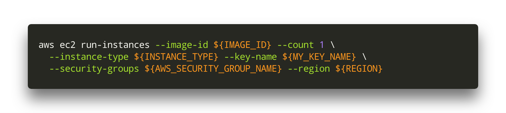

# Save $$$ on AWS by streamlining the instance creation process

So you heard about these super duper AWS instances with multiple Tesla GPU's, s**tloads of RAM and more CPU cores than Donald Trump has towers, and you're dying to work on that, but you're short of $$$?

One way to keep the costs at bay is by developing your code locally and only running your code on one of these expensive AWS instances when you feel confident that your code will actually work as expected. As you probably know, if you don't terminate your AWS instances, the clock keeps ticking and your credit card bleeds dry, so you want to keep the uptime of your instances as efficient as possible...

Developing locally and running on AWS might take a number of trial and error iterations though, so it would be nice to streamline this process of firing up new instances and killing them. That's why I created a little script that is able to create an AWS instance, upload the files I need uploaded, and starts a Jupyter notebook server. So my workflow is basically:

* Develop my code in Jupyter notebook
* Start AWS instance, upload notebook and start notebook server (with the script)
* Run the notebook until I realise I need to take some time again to think and change the code
* Download the updated notebook and kill the instance
* Rinse and repeat

## Requirements

In the script, I assume that you're running on a Mac (sorry), that you have a AWS account and that you have created a Key Pair and stored the corresponding .pem file in the folder where you're running the script to authenticate yourself with your AWS instances. If you have no clue what I'm talking about, see for example the following tutorials that will guide you through your first experience with AWS:

* [AWS EC2 Part 1: Creating EC2 instance](https://medium.com/@GalarnykMichael/aws-ec2-part-1-creating-ec2-instance-9d7f8368f78a)
* [AWS EC2 Part 2: SSH into EC2](https://medium.com/@GalarnykMichael/aws-ec2-part-2-ssh-into-ec2-instance-c7879d47b6b2)

## The AWS Command Line Interface

The way to start AWS instances from command line is done with ... \***drum roll**\* ... the AWS Command Line interface.

You install and configure this as follows:

```
# pip install awscli
yes | pip install awscli --upgrade --user

# Add the path to the awscli to your PATH variable and source your updated .bash_profile
echo 'export PATH=~/.local/bin:$PATH' >> ~/.bash_profile
source ~/.bash_profile

# Configure your AWS settings and credentials
aws configure
```

This last command will ask for you Access Key and Secret Access Key. You can get those from 'Users' in the [Identity and Access Management (IAM) section of the AWS console](https://console.aws.amazon.com/iam/home#/users).

Now you're all set to start using the AWS CLI. For detailed information about the AWS CLI, see [here](https://docs.aws.amazon.com/cli/latest/userguide/cli-chap-welcome.html).

## Firing up an instance

The critical part of the script (see the next section) is the following command which fires up an AWS instance:



Note that you need an `image_id` which is the id of the Amazon Machine Image (AMI) that you want to load onto the instance. A commonly used Deep Learning image is for example [this one](https://aws.amazon.com/marketplace/pp/B077GF11NF) with Image ID `ami-06ae1bbcb7042c6c6`. It has Tensorflow and a lot of Python stuff already pre-installed.

You also need to provide the type of instance you want to use. The beefier the instance, [the more you pay](https://aws.amazon.com/ec2/pricing/on-demand/) of course. For example, I'm using a `p3.8xlarge` instance (costs about $12 per hour). For an instance like this you need to [request an instance limit increase](https://docs.aws.amazon.com/AWSEC2/latest/UserGuide/ec2-resource-limits.html), because by default the limit is 0.

Lastly you need to provide the name of your Key Pair, the name of the Security Group you want to use (this determines which ports are going to be open and to who) and the region you want to work in (e.g. `eu-central-1` which is in Frankfurt). The Security Group is created automatically by the script.

## Let's try it out!

To run the script yourself, clone [this repository](https://github.com/tijlk/easy_aws_instances) or download the [`start_aws_instance.sh`](https://github.com/tijlk/easy_aws_instances/blob/master/start_aws_instance.sh) script directly. If you want to run the script independently from the other scripts in this repository, you should make sure that you also have a script that you want to upload to your AWS instance for configuring the instance (I called it `configure_aws_instance.sh`) and you should have a notebook that you want to run (`test_aws_instance.ipynb` in my case).

At the top of the scripts you can find all the settings that you may want to change, depending on what you're trying to do:


Let's run the script!


So the script created a Security Group opening ports 22 (so I can SSH into the instance) and port 8888, so I can work with the Jupyter notebook server on the instance from my local machine. It then started a new EC2 instance of the requested type, and copied my notebook and a configuration script to the instance. Finally it SSH'd into the instance forwarding port 8888 of the notebook server to port 8899 on my local machine.

I can then run the configuration script `configure_aws_instance.sh` to update some Python packages, maybe download some data and start the notebook server.


When I then go to localhost:8899 on my local machine, I'm faced with the familiar Jupyter interface.


I can run my notebook and see that I'm clearly on a way bigger machine than my measly Macbook :P.


When I'm done running the notebook and want to kill the instance, so I can develop a bit more on my local machine without wasting the AWS credit, I can save the notebook, and run the `terminate_instance.sh` script from my macbook which will download the updated notebook and terminate the instance.
